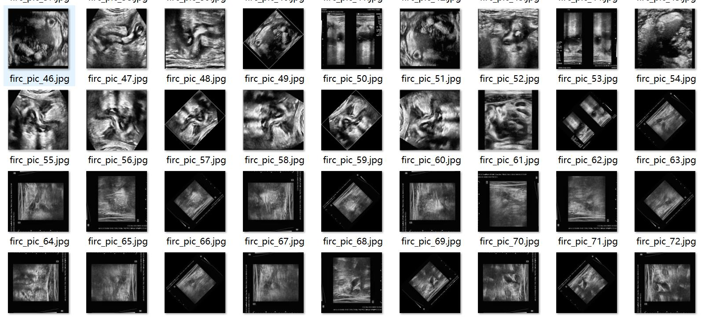
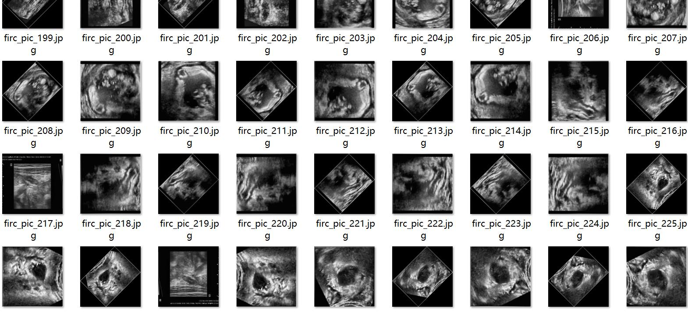
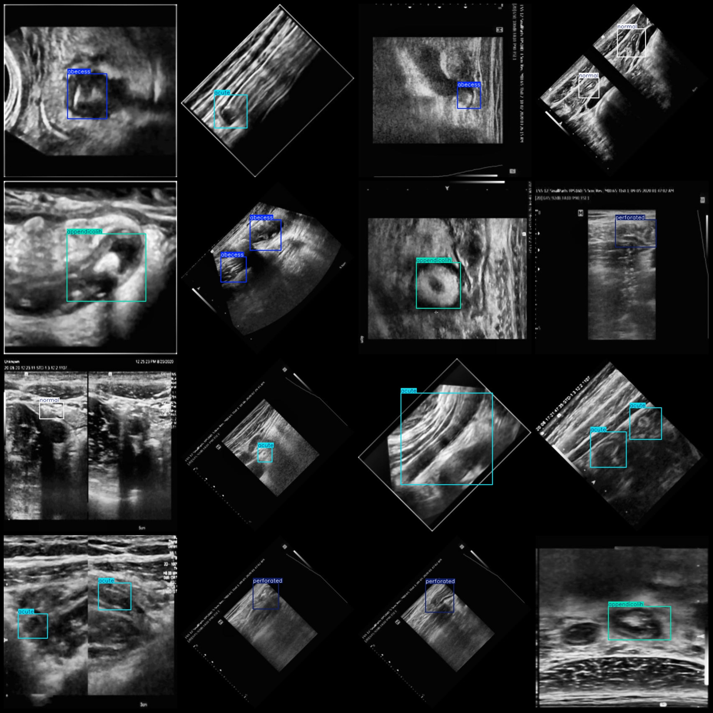
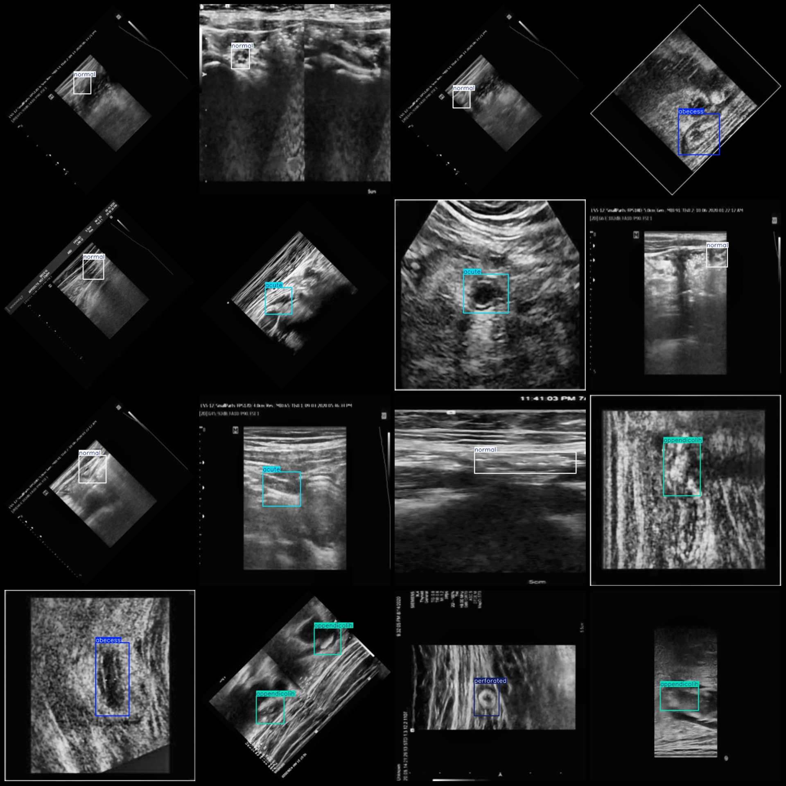
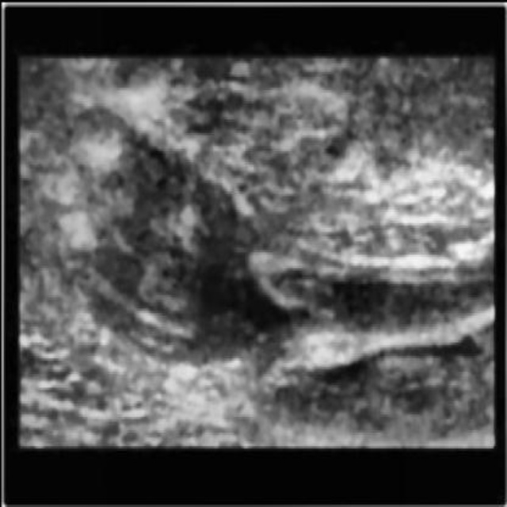
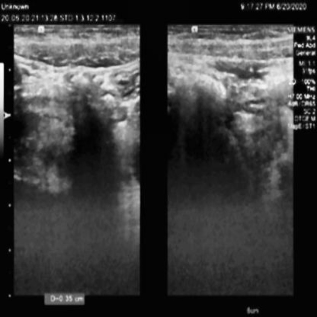
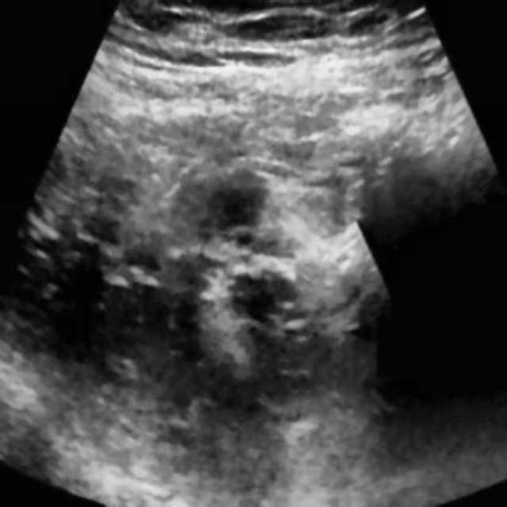

# Acute Ileitis with Perforation and Abscess Detection in Ultrasound Dataset of the Abdomen, VOC+YOLO Format, 5 Categories with Enhanced

Please note that the dataset contains images enhanced by rotation, which may not be clear enough. For specific details, please refer to the image presentation.

Dataset format: Pascal VOC format + YOLO format (txt file without split path, only contains jpg images and corresponding VOC format xml files and yolo format txt files)

Number of images (jpg file count): 4752
Number of annotations (xml file count): 4752
Number of annotations (txt file count): 4752
Number of annotation categories: 5
Annotation category names (Note the order of yolo format category names corresponds to this, with reference to the classes.txt in the labels folder): ["abecess", "acute", "appendicolih", "normal", "perforated"]

The total number of boxes in each category:
Abecess (abscess) = 990
Acute (acute appendicitis) = 1203
Appendicolih (appendix fecaliths) = 917
Normal (normal) = 1114
Perforated (perforated) = 1006
Total Boxes = 5230

The number of images per category:
Abecess (Abscess)  = 912
Acute (Acute Appendicitis)  = 1064
Appendicolih (Appendix Fistula)  = 891
Normal (Normal)  = 942
Perforated (Perforation)  = 985

Image resolution: 640x640

Use the annotation tool: labelImg

Annotation rule: Draw a rectangle around the class.

Important notes: The dataset does not have a separate training, validation, and test set. Please partition these yourself.

Special Disclaimer: This dataset does not guarantee the accuracy of the trained model or weight file.

Preview of the image:

Annotation example:
The original image shows that the clarity is similar to these images, please observe carefully.
## Images

Here is a pay link on Stripe ( https://buy.stripe.com/3cs8yP7sY87d0vu9AB ). Please contact me lonlonago@foxmail.com after funding $89, and I will send you a complete data files , thank you!

